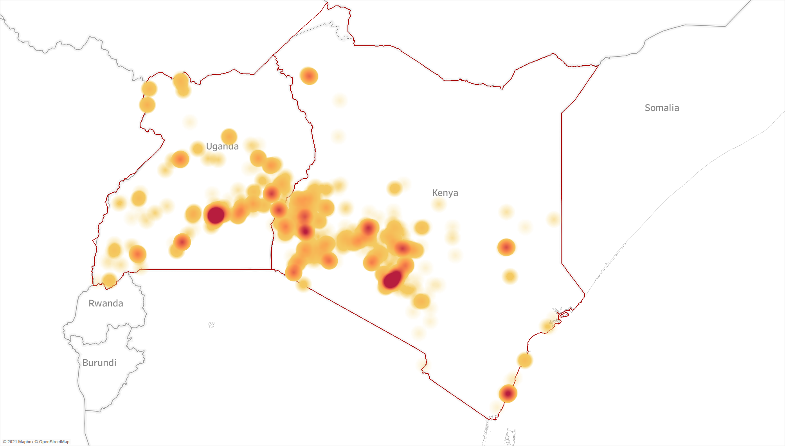

## Working papers ###
### Spatial Inequality and Informality in Kenya's Firm Network 
with Peter Wankuru Chacha, [Vatsal Khandelwal](https://sites.google.com/view/vatsalkhandelwal/home), and [Benard Kipyegon Kirui](https://www.pc.go.ke/node/378) \
[Latest draft](https://verena-wiedemann.github.io/files/WKKC_Spatial_Inequality_Informality.pdf) | [World Bank Working Paper Series](https://hdl.handle.net/10986/42215)

Abstract

  <small> The spatial configuration of domestic supply chains plays a crucial role in the transmission of shocks. This paper investigates the representativeness of formal firm-to-firm trade data in capturing overall domestic trade patterns in Kenya --- a context with a high prevalence of informal economic activity. We first document a series of stylized facts and show that informal economic activity is not randomly distributed across space and sectors, with a higher incidence of informality in downstream sectors and smaller regional markets. We then link granular transaction-level data on formal firms with data on informal economic activity to estimate a structural model and predict a counterfactual network that accounts for informal firms. We find that formal sector data overstates the spatial concentration of aggregate trade flows and under accounts for trade within regions and across regions with stronger social ties. Additionally, the higher the informality in a sector and region, the more we underestimate its vulnerability to domestic output shocks and overestimate its vulnerability to import shocks. </small>  
 
 

## Selected Work in Progress ###
### Spatial diffusion of services in Kenya 
with Peter Wankuru Chacha, [Luke Heath Milsom](https://www.lukemilsom.com/), and [Benard Kipyegon Kirui](https://www.pc.go.ke/node/378)
 
## Published Papers ###
### Supply chains in times of crisis: Evidence from Kenya's production network 
*World Development* 173 (2024) \
 with Peter Wankuru Chacha and [Benard Kipyegon Kirui](https://www.pc.go.ke/node/378) \
[Published version](https://www.sciencedirect.com/science/article/pii/S0305750X2300181X) | [Blog post for UNIDO](https://iap.unido.org/articles/bridging-gap-how-does-kenyas-domestic-firm-network-link-international-supply-chains) | [Accepted manuscript](http://verena-wiedemann.github.io/files/Covid_supply_chains_July2023.pdf) | [Replication code](http://verena-wiedemann.github.io/files/CKW_WD_replication_code.zip)

Abstract

  <small> Trading relationships between suppliers and buyers play a key role in transmitting both local and international shocks. We use transaction-level data from Kenya to study the relevance of a firm's domestic network position and links to international supply chains in determining its trajectory during the COVID-19 crisis. We document that firms with high exposure to import and export markets tend to be larger, older, and employ more workers. The specialisation of direct importers, often intermediaries, on international markets made them very vulnerable to the initial COVID-19 shock. Exporters, one-third of whom operate in primary sectors, experienced a less severe decline in sales. We find that both importers and exporters adjust their domestic supply chains in response to international trade shocks - before and during the crisis alike. Sourcing from international markets does not crowd out domestic purchases, while sales abroad and at home can act as substitutes. Diversified domestic supply chains helped firms to mitigate the impact of the COVID-19 crisis and recover more strongly. </small>  
 
 

### Taxing investments in the Asia-Pacific region: the importance of cross-border taxation and fiscal incentives.
*World Tax Journal* 8(2), pp.193-223 (2016) \
with [Katharina Nicolay](https://www.zew.de/en/team/kfi) \
[Published version](https://www.ibfd.org/shop/journal/asia-pacificinternational-taxing-investments-asia-pacific-region-importance-cross) | [ZEW working paper](https://ftp.zew.de/pub/zew-docs/dp/dp15014.pdf)  

## Other research output ###
### Changing mobility patterns and food price dynamics during the COVID-19 pandemic in Kenya and Uganda 
with [George Kariuki Kinyanjui](https://sites.google.com/view/george-kariuki-kinyanjui/home?authuser=0) and Doreen K. Rubatsimbira  \
[Bank of Uganda working paper](https://www.bou.or.ug/bou/bouwebsite/bouwebsitecontent/research/BoUworkingPapers/research/BouWorkingPapers/2021/Tracking-price-dynamics-during-a-pandemic-in-Kenya-and-Uganda_WP-02-2021.pdf) | [IGC report](https://www.theigc.org/wp-content/uploads/2021/07/Wiedmann-et-al-June-2021-Final-report.pdf) | [Policy brief](https://www.theigc.org/wp-content/uploads/2021/07/Kinyanjui-et-al-June-2021-Policy-brief.pdf) 

Abstract

 <small> Real-time price data collection during crises is crucial for informing policy responses, but can be challenging due to fast-changing consumption and mobility patterns. We adopt a crowd-sourcing approach to investigate the impact of the COVID-19 pandemic on prices of essential food items in Kenya and Uganda. Combining this price data with information on changes in mobility patterns, we find that a 10 percentage point reduction in mobility leads to a 0.3 percent and 1.5 percent increase in food prices in Kenya and Uganda, respectively. Our results are robust across a variety of empirical specifications, but we cannot conclusively rule out a zero effect in Kenya. Furthermore, our findings indicate that mobility patterns continue to impact price dynamics beyond the initial shutdown phase. </small> 
 
 

