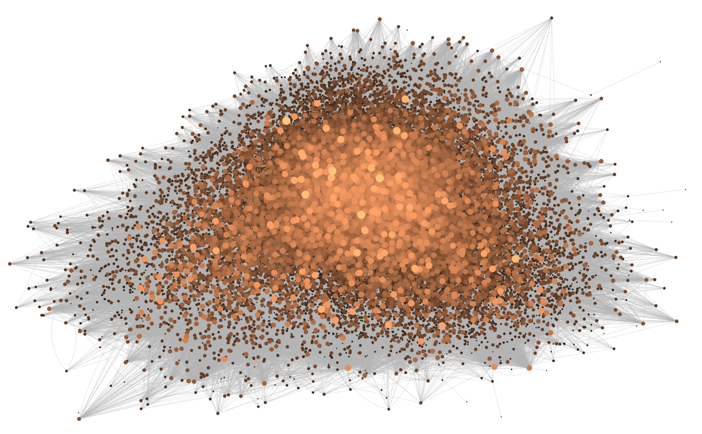
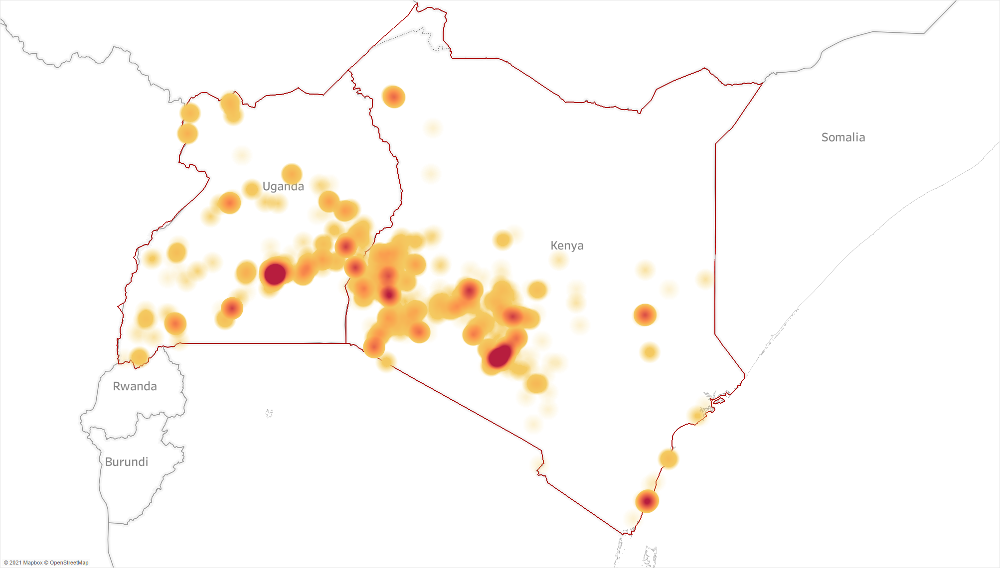

## Research ###
### Supply chains in times of crisis: Evidence from Kenya's production network 
 with Peter W. Chacha and Benard K. Kirui  \
PEDL C-19 blog posts: [Domestic and international trade flows](https://pedl.cepr.org/publications/domestic-and-international-trade-flows-during-covid-19-pandemic-evidence-kenya%E2%80%99s)| [Employment in formal firms](https://pedl.cepr.org/publications/short-term-impact-covid-19-shock-employment-formal-firms-kenya) 

Abstract

  <small> Trading relationships between suppliers and buyers play a key role in transmitting both local and international shocks. We use rich transaction-level data from Kenya to study the relevance of a firm's domestic network position and links to international supply chains in determining its trajectory during the COVID-19 crisis. We document that firms with varying degrees of exposure to import and export markets differ substantially in terms of their size and age profile. The specialisation of direct importers, often intermediaries, on international markets made them very vulnerable to the initial COVID-19 shock. Exporters, one-third of which operate in primary sectors, experienced a less drastic downturn. We find that both importers and exporters adjust their domestic supply chains in response to international trade shocks. Sourcing from international markets crowds in domestic purchases, while sales abroad and at home are substitutes. Diversified domestic networks further helped to mitigate the impact of severe shocks like the COVID-19 crisis and contributed to a stronger recovery. </small>  
 
 

### Tracking price dynamics during a pandemic in Kenya and Uganda 
with [George K. Kinyanjui](https://sites.google.com/view/george-kariuki-kinyanjui/home?authuser=0) and Doreen K. Rubatsimbira  \
[Bank of Uganda working paper](https://www.bou.or.ug/bou/bouwebsite/bouwebsitecontent/research/BoUworkingPapers/research/BouWorkingPapers/2021/Tracking-price-dynamics-during-a-pandemic-in-Kenya-and-Uganda_WP-02-2021.pdf)| [IGC report](https://www.theigc.org/wp-content/uploads/2021/07/Wiedmann-et-al-June-2021-Final-report.pdf) | [Policy brief](https://www.theigc.org/wp-content/uploads/2021/07/Kinyanjui-et-al-June-2021-Policy-brief.pdf) 

Abstract

 <small> As the Covid-19 pandemic unfolded across the globe, the economic impact has been characterised by a combination of supply and demand shocks with an *a priori* unclear effect on price dynamics. Using real-time primary price data covering a wide range of geographic areas, we track the impact of the pandemic on prices in Kenya and Uganda during the initial shutdown period and the subsequent re-opening phase. We find evidence that price levels for essential food items were higher during the initial phase of the pandemic. The impact was short-lived and moderate in Kenya, but continued for an extended period in Uganda where government restrictions were tighter and in place for a more prolonged period of time. We further combine the price data with information on changes in visiting patterns of smartphone users at localities like workplaces, grocery stores and other retail locations. The results suggest that mobility patterns continue to have an impact on price dynamics beyond the initial shutdown phase. We estimate that a 10 percentage point reduction in activities at workplace locations leads to a 0.3% and 1.4% increase in food prices in Kenya and Uganda respectively. This result is stable across a variety of empirical specifications, although we cannot rule out that the effect is zero in Kenya. </small> 
 
 

## Pre-doctoral publication ###
### Taxing investments in the Asia-Pacific region: the importance of cross-border taxation and fiscal incentives.
*World Tax Journal* 8(2), pp.193-223 (2016) \
with [Katharina Nicolay](https://www.zew.de/en/team/kfi) \
[ZEW working paper](https://ftp.zew.de/pub/zew-docs/dp/dp15014.pdf) | [Published version](https://www.ibfd.org/shop/journal/asia-pacificinternational-taxing-investments-asia-pacific-region-importance-cross)

  

